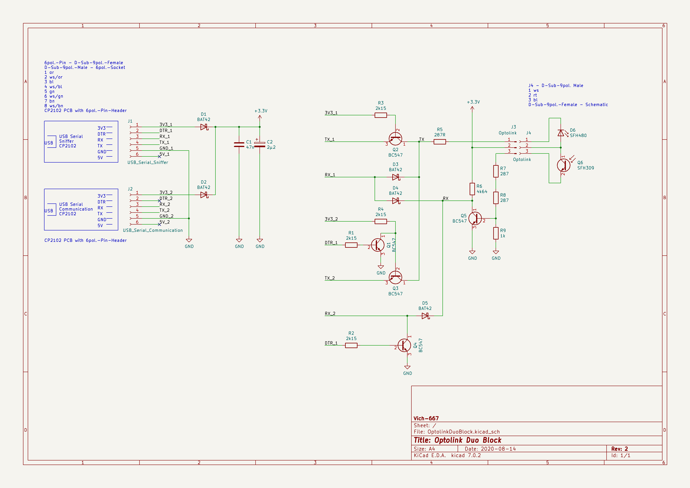

# Optolink Duo Block

This project was created to have local access to the viessmann heating system to monitor and control and have the vitoconnect still working.
In [OpenV Wiki](https://github.com/openv/openv) and it's issue section can be found a lot of information and links to other interesting Projects.
But all of them either only monitor the communication between the heating system and the vitoconnect or the directly communicate with the heating system.
Therefore, this project was started to control the connection of the vitoconnect from the monitoring pc.

The basic idea of this project was taken from [USB_Duo-Sniffer](https://github.com/openv/openv/wiki/Bauanleitung-USB_Duo-Sniffer).
I extended the circuit to be able to block the vitoconnect to be able to send read or write commands directly to the heating system.

Finally, the heatpump should be integrated into my [OpenHAB](https://www.openhab.org/) installation to monitor the status and
control it depending on PV power and weather situation. Due to the reason I'm not very familiar with Java (and the long delay of PR reviews) I wrote the
Software with Python and reused a simple HTTP Server from another Project to integrate it into OpenHABs via the http plugin. So this Project can be also
reused in other context.

## Project

| Folder     | Content                                                                                                                           |
|------------|-----------------------------------------------------------------------------------------------------------------------------------|
| Datasheet  | Datasheets of used components                                                                                                     |
| PCB        | Schematic and PCP design. Created with [KiCad](https://www.kicad.org/)                                                            |
| Pictures   | Pictures of the Optolink Duo Block                                                                                                |
| Simulation | Electrical Simulation with [LTSpice](https://www.analog.com/en/design-center/design-tools-and-calculators/ltspice-simulator.html) |
| Software   | Software to monitor and read/write written in Python.                                                                             |

## Hardware

The schematic from [USB_Duo-Sniffer](https://github.com/openv/openv/wiki/Bauanleitung-USB_Duo-Sniffer)
was reused and extended in a way that with the DTR Pin of the sniffer PC the Tx as well the Rx from the Vitoconnect can be blocked. In block mode 
read and write messages can be sent directly to the heating system. In unblock mode the vitoconnect can communicate and the communication can be monitored.

The IR PCB was created in a similar way you can find it in [OpenV Wiki](https://github.com/openv/openv)
as well. To fit it exact inside the cover, I simply put some tape around it and filled up the backside with
hot glue, that it has nearby the same size as the original. 

The circuit was soldered with TH components. And placed into an additional box. The advantage of this hardware solution over a proxy solution is that the vitoconnect can work
as long the pc is not connected or the DTR pin is low.

# Software
The `vito_monitor_ctrl` is the basic lib (it can be reused in other applications or projects) what provides the `VitocalHandler` class. This class factor the whole thing and
provides methods to read and write data points.

Basically there is the `VitoDatahandler` Interface with its two implementation, for monitoring the vitoconnect and the direct read / write access. To not direct deepened on any
hardware there is the `OptolinkMAC` to abstract them. An implementation for the **OptolinkDuoBlock** as well as a Dummy for testing without hardware exists. Also a implementation
for the Proxy solution was created, but never tested or used.

## Configuration
Data point to be read and write need to be configured either statically via `value_config.py` or you can set the dict during runtime. This dict contains the data point names as
key and a parameter dict with fixed names.
 
`"Aussentemperatur": { "address": 0x1234, "unit": "UT", "access": 1 , "description": "anyting, currently unused", "data_bytes": 4 }`

| Key         | Info                                                                             |
|-------------|----------------------------------------------------------------------------------|
| address     | Address of data point                                                            |
| unit        | Unit to convert data, see `vito_data_handler.py`                                 |
| data_bytes  | Number of bytes to read / write independent from unit                            |
| access      | Access type: MONITOR = 0x01, READOUT = 0x02, WRITE = 0x04 or any and combination |
| description | Any description, currently not used                                              |

## Applications

- `cmd_line_main.py`: This application provides a simple shell for testing
  - press Enter to print out the current values
  - `w <data_point_name> <value>` to write a data point
  - `exit` to close

- `http_server_main.py`: http server to be accessed from any other tools
  - it simply can be tested with `curl localhost:8006 | jq -C`
  - GET `http://localhost:8006` or `http://localhost:8006/getstatus/` a json object with all current values and system status is provided
  - POST `http://localhost:8006/set/vito/<data_point_name>` to write the data, the value need to be provided as a plain test
  - POST `http://localhost:8006/set/vito/configuration` to set the config. It needs to be provided as a json object
